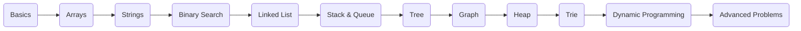
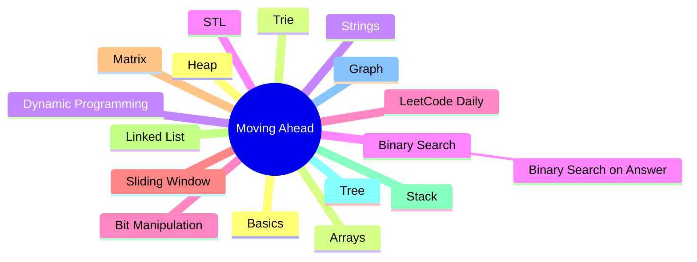
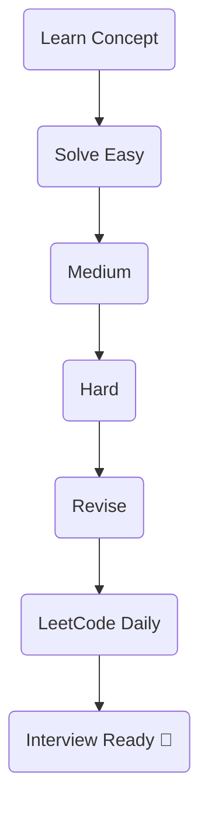

<div align="center">

# 🚀 Moving Ahead

### *My Complete Data Structures & Algorithms Journey*


</div>

---

# 📖 About

**Moving Ahead** is my personal repository where I document everything I learn while preparing for Software Engineering interviews.

Instead of uploading random code, every folder represents one milestone in my journey—from learning the basics to solving advanced interview problems.

---

# 🗺️ Learning Roadmap



---

# 📂 Repository Architecture



---

# 🎯 What You'll Find

<table>
<tr>
<td width="50%">

### 📚 Learning

- Topic-wise DSA
- Interview Questions
- STL
- Notes
- Concepts

</td>

<td width="50%">

### 💻 Coding

- C++ Solutions
- Optimized Code
- LeetCode Daily
- Pattern Based Learning
- Revision

</td>

</tr>
</table>

---

# ⚡ Workflow



---

# 📊 Repository Structure

```text
Moving_ahead
│
├── Arrays
├── Basics
├── BinarySearch
├── Binary_Search_On_Answer
├── Bits_Manipulation
├── Dynamic_Programming
├── Graph
├── Heap
├── Leetcode Daily
├── Matrix
├── Sliding_Window
├── Stack
├── Strings
├── Tree
├── Trie
├── STL
└── ...
```

---

# 💡 Philosophy

> **"Consistency beats intensity."**

One problem every day is better than solving 100 problems once.

This repository is a reflection of my journey toward becoming a better software engineer.

---

<div align="center">

### ⭐ If you find this repository useful, consider giving it a Star!

**Happy Coding ❤️**

</div>
