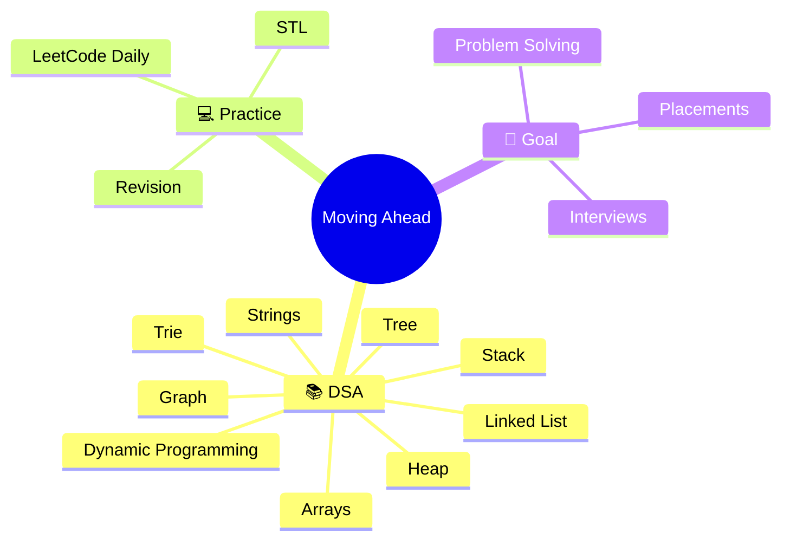
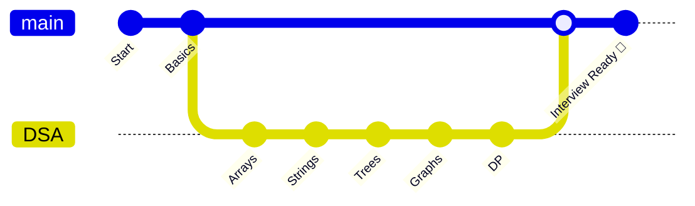

<div align="center">

# 🚀 Moving Ahead

### *"Mountains are climbed one step at a time, not one leap at a time."*


</div>

---

## 🌱 Why "Moving Ahead"?

Most repositories are collections of code.

This one is different.

**Moving Ahead** is a record of my growth—not my perfection.

Every folder represents a challenge I once couldn't solve.
Every commit represents a lesson I didn't know yesterday.
Every problem solved is one more step toward becoming a better software engineer.

> **I don't measure progress by how far I've come. I measure it by whether I moved forward today.**

---

# 🗺️ The Journey


---

# 🧠 Repository Map



---

# ⚡ Philosophy

```text
Knowledge without practice fades.

Practice without consistency fails.

Consistency without purpose burns out.

Purpose + Consistency + Practice = Growth.
```

---

# 📂 Repository Structure

```text
📦 Moving_Ahead
 ┣ 📂 Arrays
 ┣ 📂 Strings
 ┣ 📂 Binary Search
 ┣ 📂 Binary Search on Answer
 ┣ 📂 Sliding Window
 ┣ 📂 Linked List
 ┣ 📂 Stack
 ┣ 📂 Tree
 ┣ 📂 Graph
 ┣ 📂 Heap
 ┣ 📂 Trie
 ┣ 📂 Dynamic Programming
 ┣ 📂 Matrix
 ┣ 📂 Bit Manipulation
 ┣ 📂 STL
 ┗ 📂 LeetCode Daily
```

---

# 🎯 What You'll Find Here

<table>
<tr>

<td width="50%">

### 📖 Learning

- Topic-wise DSA
- Important Concepts
- Notes
- STL
- Interview Patterns

</td>

<td width="50%">

### 💻 Coding

- Clean C++ Solutions
- Optimized Approaches
- Multiple Solutions
- Complexity Analysis
- Daily Practice

</td>

</tr>
</table>

---

# 📈 Growth Mindset



---

# ⭐ A Reminder

> **"You don't become exceptional by doing something extraordinary once. You become exceptional by doing ordinary things extraordinarily consistently."**

If this repository helps you in your journey, consider giving it a ⭐.

And remember—

## **Keep Moving Ahead. 🚀**
